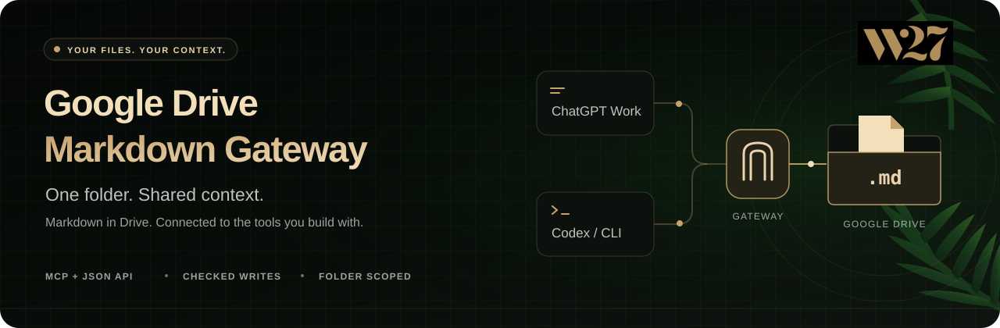

# Google Drive Markdown Gateway

A focused bridge between AI tools and your Markdown files in Google Drive. Keep specifications,
implementation briefs, drafts, and working notes in one folder, and let authenticated ChatGPT Work
and Codex clients work with the same documents.

The gateway exposes the same six operations through a JSON API and a stateless MCP endpoint: list,
search, read, create, update, and archive. Google Drive access stays on the server. Clients
authenticate to the gateway and never receive Google credentials.

**Current status:** the service, Google Drive adapters, CLI, MCP integration, and deployment tooling
are implemented. The default deployment is read-only. Live Drive behavior, deployment configuration,
and each client integration must pass the documented release checks; local tests are not evidence
of a production deployment or a validated ChatGPT Work installation.

## Why use it?

- **Shared context across tools.** Draft a brief with ChatGPT Work, read it from Codex while
  implementing, and keep the document in your existing Google Drive workflow.
- **Ordinary Markdown files.** Content stays in portable UTF-8 `.md` files, accessible through
  Drive and your preferred Markdown tools.
- **Conflict-aware editing.** Reads return a revision; updates must supply it. Stale changes fail
  instead of silently replacing a newer version.
- **A bounded integration.** The gateway enforces one configured folder tree and six document
  operations, with no sharing management, permanent deletion, or general-purpose Drive proxy.
- **Server-side Google access.** Clients use their own gateway authentication. Google credentials
  stay with the service.

This project handles literal Markdown files, not Google Docs, Sheets, Slides, or binary uploads.
It is a service and client toolkit, not a document editor.

## What it does

| Operation | Behavior |
| --- | --- |
| List | List Markdown files in a folder, optionally including nested folders. |
| Search | Search filenames and file content within configured limits. |
| Read | Retrieve content, file identity, and the current revision by path or file ID. |
| Create | Add a Markdown file under an existing folder; refuse an occupied destination. |
| Update | Replace a file only when the supplied revision matches. |
| Archive | Move a file into the configured archive folder using its current revision. |

The service enforces these boundaries:

- access is confined to the configured Markdown root and archive folder;
- writes are disabled by default and must be enabled by a reviewed deployment;
- updates and archives require the current Drive revision;
- archive moves a file to the configured archive folder—it never deletes or trashes it; and
- a conflict, timeout, or `OUTCOME_UNKNOWN` result must be reread and reconciled, never retried
  automatically.

## Use the CLI

The checked-in `md-drive` client emits machine-readable JSON and uses stable exit codes. Build it
with `mise run build`, then run it directly from the checkout. It is not a published npm package.

Before making requests, configure a deployed gateway using the
[client setup guide](docs/codex-cloud-client-setup.md). The client requires `MD_DRIVE_GATEWAY_URL`
and exactly one of `MD_DRIVE_BEARER_TOKEN` or `MD_DRIVE_BEARER_SECRET_FILE`, supplied outside Git.

```bash
# Explore an existing folder and read a document.
node dist/codex-cli/cli.js list --path specs --recursive
node dist/codex-cli/cli.js search "release plan" --path specs --limit 10
node dist/codex-cli/cli.js read --path specs/release-plan.md
```

On a separately approved write-enabled deployment:

```bash
# Create from a local UTF-8 Markdown file; the destination folder must exist.
node dist/codex-cli/cli.js create drafts/new-post.md --file ./new-post.md

# Replace REVISION_FROM_READ with the exact revision from the latest read.
node dist/codex-cli/cli.js update --path specs/release-plan.md \
  --revision 'REVISION_FROM_READ' --file ./release-plan.md

# Archive only when intended, using this file's latest revision.
node dist/codex-cli/cli.js archive --path drafts/old-post.md \
  --revision 'REVISION_FROM_READ'
```

For updates and archives, read first and retain the exact revision. On `CONFLICT`, reread and
reconcile the changes. After a timeout or `OUTCOME_UNKNOWN`, inspect the file before deciding what
to do next; do not automatically retry the mutation. `UNSUPPORTED` is expected for writes on the
default read-only deployment.

## How it fits together

```text
ChatGPT Work ── JWT ────── /mcp ─────────────┐
                                           ├── MarkdownService ── Google Drive
Codex / md-drive ── bearer ── /v1/markdown/* ┘        │              configured root
                                              guarded writes
```

Both interfaces share the same application policy. The service uses TypeScript and Express on
Node.js 24, with stateless Streamable HTTP MCP. Google authentication supports Shared Drive
application default credentials or My Drive OAuth refresh tokens. Docker and Terraform assets
target Google Cloud Run.

The [ChatGPT Work package](plugin/chatgpt-work/README.md) provides registration templates,
instructions, and a validation checklist. Its installation format and authentication settings
must be verified for the target tenant; it is not a ready-to-upload universal plugin manifest.

For the detailed component map and change guidance, see [`ARCHITECTURE.md`](ARCHITECTURE.md). The
original product brief is
[`google-drive-markdown-gateway-handoff.md`](google-drive-markdown-gateway-handoff.md), and the
implementation history and approved feature plans are under
[`ai/features/epics/google-drive-markdown-gateway/`](ai/features/epics/google-drive-markdown-gateway/).

## Test locally

Local development requires mise 2026.9.1 or newer. The checked-in mise configuration installs the
locked Node.js 24 and pnpm 11.19.0 toolchain. A normal local test run uses fakes and in-memory
adapters; it does not need Google credentials, call Google Drive, deploy anything, or enable writes.

From a fresh checkout:

```bash
./scripts/verify-vendored-skills.sh
mise install
mise run install
CI=true mise run check
```

`mise run check` is the complete repository validation. It runs linting, formatting checks, strict
TypeScript checking, the Vitest suite, the production build, and the vendored-workflow integrity
check.

For a quicker check while developing, run the relevant command directly:

| What to check | Command |
| --- | --- |
| Lint | `CI=true mise run lint` |
| Formatting without changing files | `CI=true mise run format:check` |
| Apply formatting | `mise run format` |
| Types | `CI=true mise run typecheck` |
| Automated tests | `CI=true mise run test` |
| One test file | `CI=true mise run test -- tests/domain/markdown.test.ts` |
| Production build and `md-drive` CLI | `CI=true mise run build` |
| Vendored workflow files only | `./scripts/verify-vendored-skills.sh` |

Live Drive probes, client release checks, Terraform plans/applies, secret rotation, and migration
cutover are intentionally not part of local or CI validation. They require an approved operator,
external credentials/configuration, and the matching runbook below. Generated evidence and all
secrets must stay outside the repository.

## Runbook guide

Use the narrowest guide that matches the work. Several release procedures are sequential gates;
passing one does not authorize the next and does not enable runtime writes.

| Situation | Use this guide | When it applies |
| --- | --- | --- |
| Plan or implement repository work in Codex cloud | [`docs/codex-cloud-preflight.md`](docs/codex-cloud-preflight.md) | Before using the repository's architecture or shipping workflow in a cloud task. It checks vendored skills and the required agent/runtime capabilities; it does not configure a gateway client. |
| Deploy or roll back the service on Cloud Run | [`docs/cloud-run-deployment.md`](docs/cloud-run-deployment.md) | For approved Terraform, image, IAM, Secret Manager, deployment, verification, rotation, and rollback work. Deployments remain read-only unless the separate write gates are satisfied. |
| Prove Google Drive revision behavior in a disposable folder | [`docs/live-drive-capability-harness.md`](docs/live-drive-capability-harness.md) | Before considering a controlled write-enabled release. This operator-only probe tests the provider against a marked test root; it is not a normal test and does not enable product writes. |
| Decide whether a write-enabled revision and clients are releasable | [`docs/write-gate-and-client-validation.md`](docs/write-gate-and-client-validation.md) | After independent review and live-Drive evidence. It defines the ordered deployment, Work, and Codex evidence gates and the rollback decision. |
| Configure and validate the checked-in Codex cloud client | [`docs/codex-cloud-client-setup.md`](docs/codex-cloud-client-setup.md) | After a gateway and controlled Codex cloud environment already exist. It covers narrow egress, secret injection, `md-drive` use, and the operator-only client harness. |
| Package or validate the private ChatGPT Work integration | [`plugin/chatgpt-work/README.md`](plugin/chatgpt-work/README.md) | After confirming the current tenant's private-plugin format and after the gateway release prerequisites exist. Use its manual live-validation checklist for Work release evidence. |
| Respond to an incident, rotate credentials, recover a Drive version, or configure alerts | [`docs/operations.md`](docs/operations.md) | For service operators, identity owners, Drive administrators, and deployment administrators during approved exercises or production operations. |
| Configure telemetry or review what may be logged/measured | [`docs/observability-contract.md`](docs/observability-contract.md) | Before adding a metrics/logging backend, dashboard, alert query, or new telemetry. It is the allowlist for audit fields, metrics, and labels. |
| Review security boundaries or abuse cases | [`docs/threat-model.md`](docs/threat-model.md) | During architecture, security, deployment, and incident reviews, especially when changing authentication, Drive scope, write behavior, or telemetry. |
| Prepare a planning-file migration | [`docs/planning-file-source-of-truth.md`](docs/planning-file-source-of-truth.md) | First, to determine which planning documents may become Drive-owned and which artifacts must remain Git-owned. |
| Execute the planning-file cutover preflight | [`docs/planning-file-cutover.md`](docs/planning-file-cutover.md) | Only after the source-of-truth policy and write/client release gates are satisfied. The local command validates an external checklist and evidence shape; it does not make Drive requests or declare cutover success. |

## Where to look in the code

- `src/domain/` and `src/application/` contain Markdown rules, root confinement, and revision policy.
- `src/drive/` contains the provider boundary and Google Drive adapters.
- `src/http/` exposes the JSON API; `src/mcp/` exposes the stateless MCP endpoint.
- `src/runtime/` composes authentication, Drive access, telemetry, and deployment-owned write
  authority.
- `src/codex-cli/`, `src/live-drive/`, `src/codex-cloud/`, and `src/planning-migration/` are client or
  operator tools, not production request handlers.
- `infra/terraform/` contains the Cloud Run deployment module.
- `tests/` mirrors the production boundaries and contains the credential-free local test suite.

Before planning or implementing any change, run `./scripts/verify-vendored-skills.sh` and follow the
workflow in [`AGENTS.md`](AGENTS.md). Never commit Google credentials, OAuth refresh tokens,
service-account keys, gateway bearer credentials, live evidence, or operator-specific
configuration.

## License

Licensed under the [MIT License](LICENSE).
