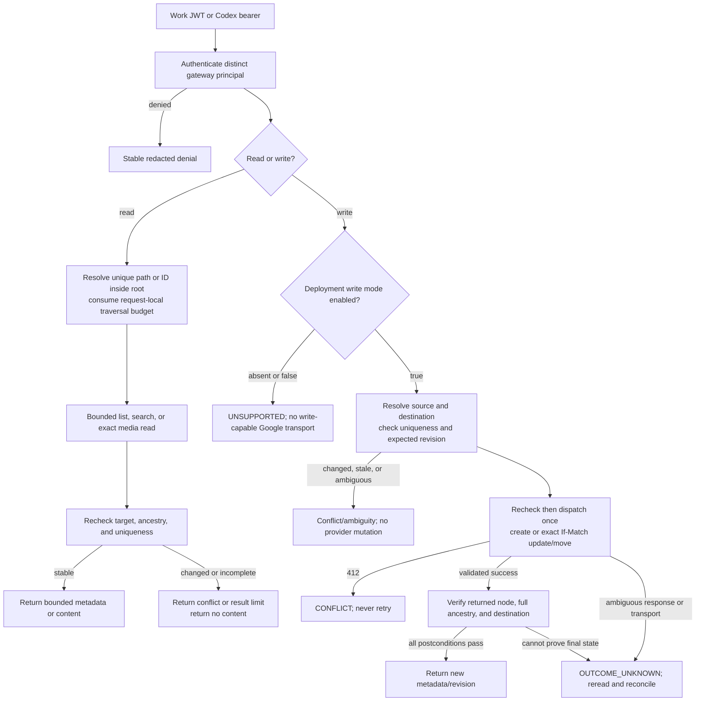
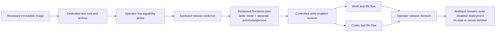

# Operation Flow

```mermaid
flowchart TD
    client[Work JWT or Codex bearer] --> auth[Authenticate distinct gateway principal]
    auth -->|denied| deny[Stable redacted denial]
    auth --> op{Read or write?}

    op -->|read| snapshot[Resolve unique path or ID inside root\nconsume request-local traversal budget]
    snapshot --> read[Bounded list, search, or exact media read]
    read --> readcheck[Recheck target, ancestry, and uniqueness]
    readcheck -->|stable| readok[Return bounded metadata or content]
    readcheck -->|changed or incomplete| safeconflict[Return conflict or result limit\nreturn no content]

    op -->|write| mode{Deployment write mode enabled?}
    mode -->|absent or false| unavailable[UNSUPPORTED; no write-capable Google transport]
    mode -->|true| pre[Resolve source and destination\ncheck uniqueness and expected revision]
    pre -->|changed, stale, or ambiguous| nomutation[Conflict/ambiguity; no provider mutation]
    pre --> dispatch[Recheck then dispatch once\ncreate or exact If-Match update/move]
    dispatch -->|412| conflict[CONFLICT; never retry]
    dispatch -->|validated success| post[Verify returned node, full ancestry, and destination]
    dispatch -->|ambiguous response or transport| unknown[OUTCOME_UNKNOWN; reread and reconcile]
    post -->|all postconditions pass| writeok[Return new metadata/revision]
    post -->|cannot prove final state| unknown
```

```mermaid
flowchart LR
    code[Reviewed immutable image] --> testroot[Dedicated test root and archive]
    testroot --> probe[Operator live capability probe]
    probe --> evidence[Sanitized release evidence]
    evidence --> plan[Reviewed Terraform plan\nwrite mode + separate acknowledgement]
    plan --> deploy[Controlled write-enabled revision]
    deploy --> work[Work test-file flow]
    deploy --> codex[Codex test-file flow]
    work --> release[Operator release decision]
    codex --> release
    release --> rollback[Rollback remains write-disabled deployment\nno data or secret deletion]
```

The first flow describes runtime checks, not a Drive transaction. The second describes operator
gates; neither planning nor local tests satisfy them.
